# Understanding global biodiversity change

Biodiversity is a fragile, emerging state on a rock drifting through
space

## What shapes biodiversity 

Life in Earth is constantly changing due to:

-   Environmental change

-   Habitat loss

-   Biological invasions

-   Drift & Stochasticity

## Biodiversity is unevenly distributed

Despite constant change, biodiversity shows structure:

-   Global richness gradients

-   Spatial structure

-   Temporal succession

## From biodiversity patterns to ecological processes

-   Two major frameworks

    -   Island biogeography **–\>** *How many species occur?*

    -   Community assembly **–\>** *Which species occur and why?*

## Community assembly theory as a framework to understand biodiversity change

> What are the mechanisms shaping species composition?

-   Community assembly provides:

    -   Mathematical framework for representing the structure of
        ecosystems

    -   Mechanistic explanations of species coexistence and turnover

    -   Theory that can be supported with experimental and observational
        data.

## Core processes in community assembly

> Community composition = Assembly processes in the regional species
> pool

-   Four 'fundamental' forces shaping communities

    -   Speciation\\Extinction

        -   Generates new species, terminates species

    -   Selection

        -   Environmental filtering

        -   Biotic interactions

    -   Dispersal

        -   Species movement

    -   Drift

        -   Stochastic demographic changes

        -   Neutral dynamics

## Speciation and extinction


## Selection (Niche-based processes):

-   Environmental filters

    -   Fundamental niches

-   Biotic interactions

    -   Realized niche

        -   Competitive exclusion

        -   Trait-matching

            

## Dispersal and Drift

Dispersal: Movement of species across space

-   Range expansions

-   Colonization

-   Spatial connectivity

Drift: Random fluctuation in populations

-   Demographic stochasticity

-   Random death and immigration

-   Environmental disturbances

-   Mutations

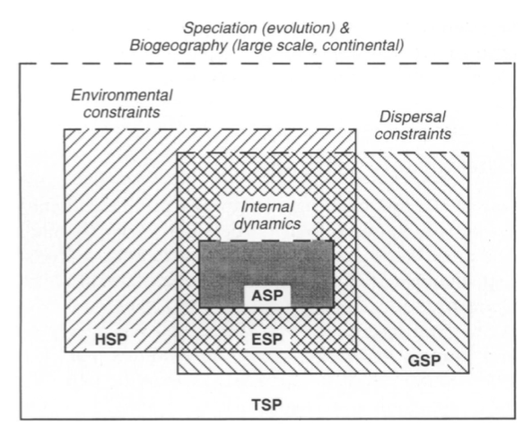

## Mechanisms underpinning patterns in species turnover

-   Turnover: Degree or taxonomic replacement

-   Classic perspective:

    -   Clementian view: Species ranges overlap based on same
        fundamental niches - communities as superorganisms - modular
        structure

    -   Gleasonian view: Fundamental niches are not related to one
        another

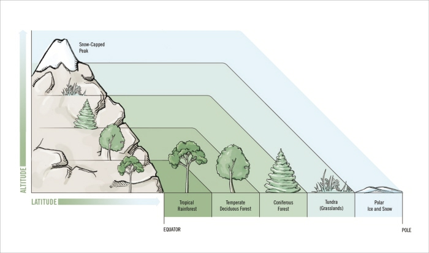

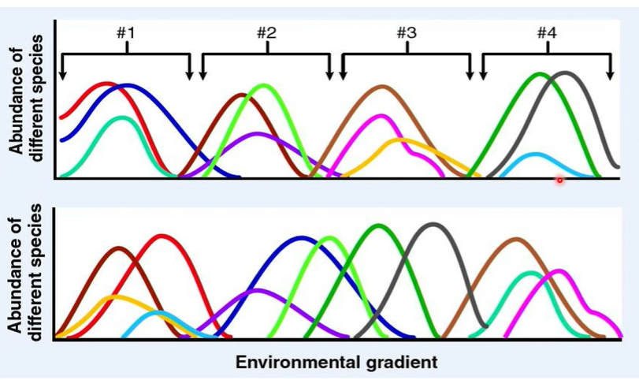

## Biotic interactions shape community structure

> Species interactions modifies species population growth rates within
> communities

-   Within trophic levels
    -   Competitive exclusion
-   Across trophic levels
    -   Predation
    -   Mutualisms
    -   Parasitims
    -   Etc.
-   Trophic cascades
    -   Top-down
        -   Mesopredator release
    -   Bottom-up
        -   Resource availability

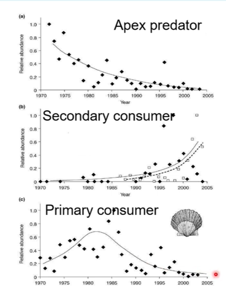

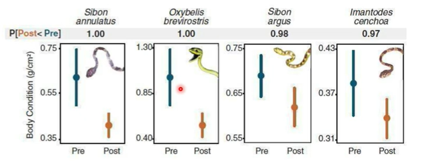

## Challenges in understanding global biodiversity change

Understanding biodiversity dynamics is difficult because:

-   There is no single analytic solution

-   Models fitted to observed data or simulations

-   Data represents snapshopts of multidimensional processes

    -   Time by space substitution

    -   Multitrophic perspective

Additional challenges include:

-   Data hungry models

-   Research silos

-   Un-even data collection efforts

## Data integration challenge 

-   Ecological data are scattered across:

    -   Literature

    -   Museum records

    -   Private databases

-   Global datasets are now available and open-source

    -   Integrating multiple types of environmental and biodiversity
        data \\

    -   Unified analytical frameworks

## Abiotic environment as a driver of large scale changes

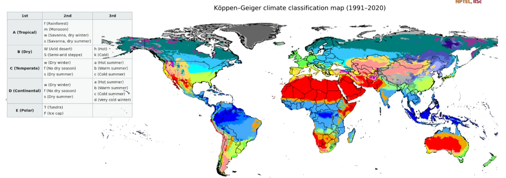

-   Climate change reshapes the conditions under which ecological
    communities form and persist

-   Climate change modifies not just where species can live, but which
    combinations of traits and interactions are feasible

## 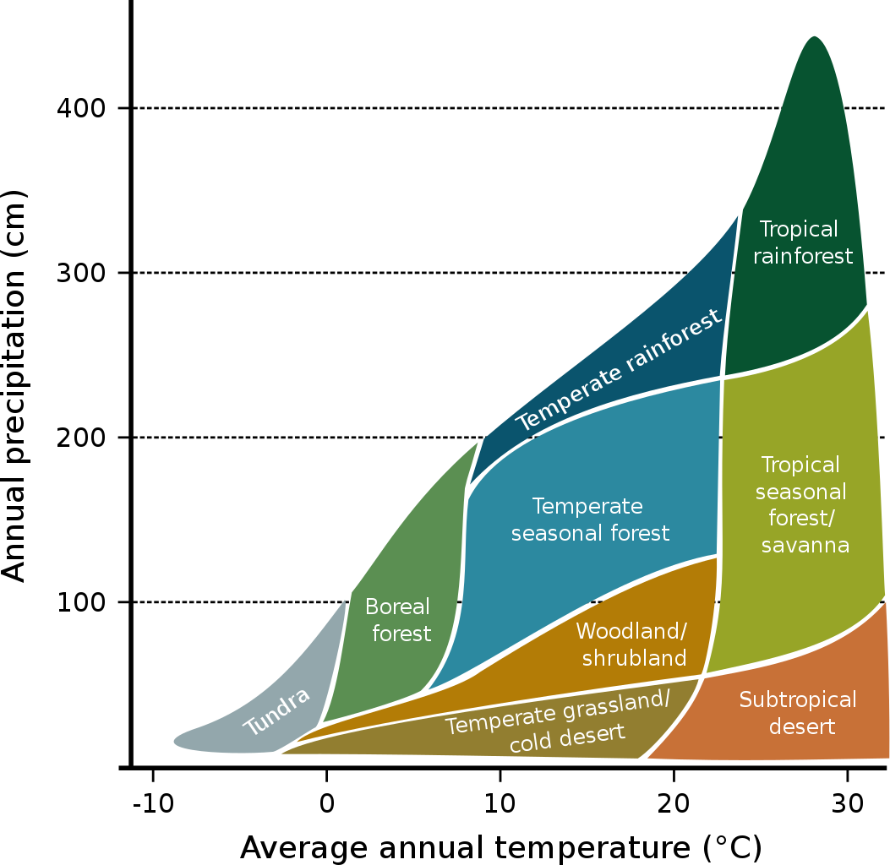

## Functional traits bridge environmental gradients and species interactions

## Chapter 1: Climate change as a driver of deep-time assembly

-   Climate change is not weather and one can not experience climate
    change in a lifetime

-   Todays weather is not a picture of todays climate

-   Ecological communities reflect filtering and colonization across
    climate gradients

-   Space for time substitution

-   Time-series covering only small geographic ranges

## 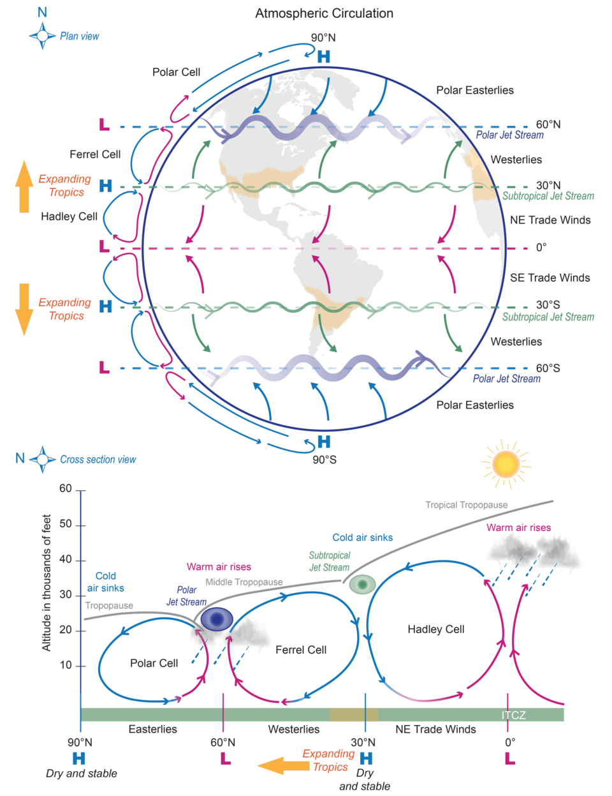

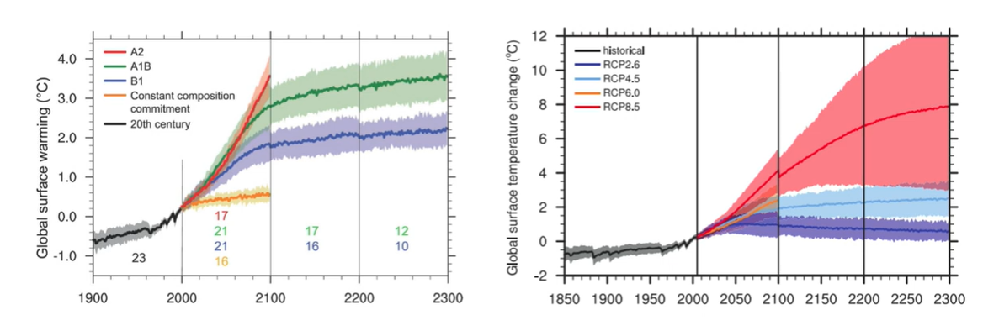

# Chapter Overview

-   Chapter 1: Inferring network assembly mechanisms

-   Chapter 2: Climate-driven functional asymmetry and network structure

-   Chapter 3: Deep-time climate dynamics and biodiversity assembly

# Chapter 1: Trait-based inference of ecological network assembly

::::: columns
::: {.column width="40%"}
-   Does assembly processes generate emergent network structure?

-   Simulating network assembly

-   Inferring assembly processes using trait-based null models
:::

::: {.column width="60%"}
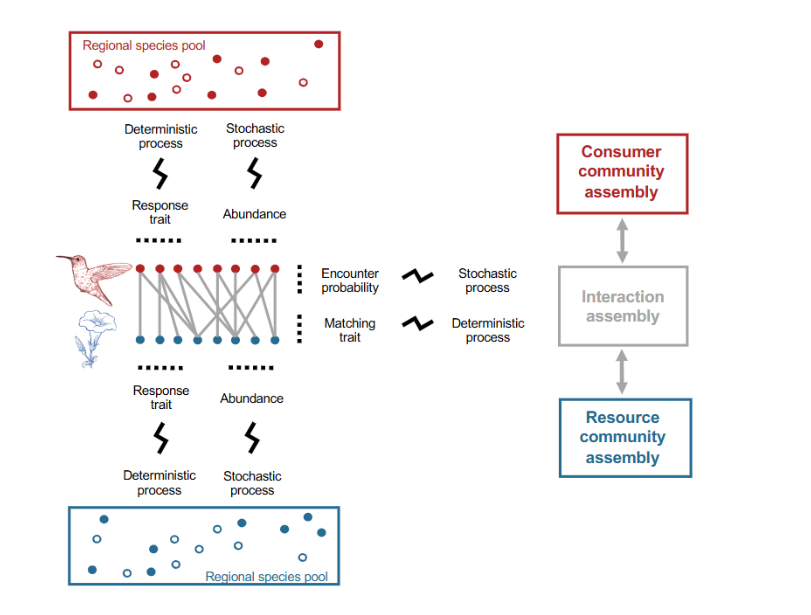
:::
:::::

## Chapter 1: Simulating network assembly

::::: columns
::: {.column width="50%"}
-   Individual-based, spatially implicit assembly models
    -   Reference-pool species vary in abundance and trait values\
    -   Immigration is trait-filtered\
    -   Established lineages diversify via neutral stochastic drift
-   Community assembly
    -   `SEF`: environmental filtering\
    -   `ND`: neutral dynamics
-   Interaction assembly
    -   `MM`: morphological matching\
    -   `FL`: forbidden links\
    -   `NL`: stochastic interactions (abundance)
-   Calculate **NODF** and **Q**
:::

::: {.column width="50%"}
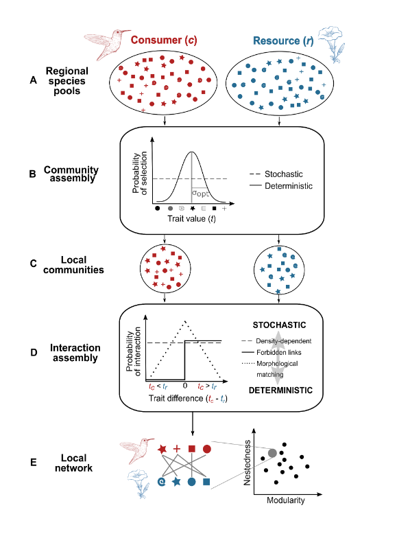{width="100%"}
:::
:::::

## Chapter 1: Simulating network assembly

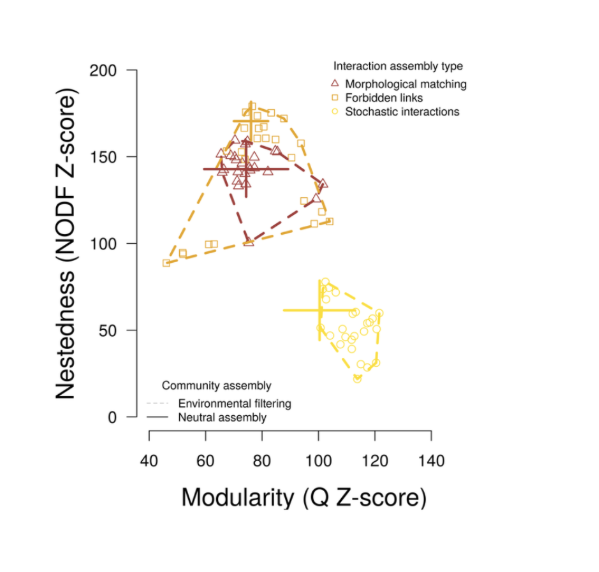{fig-align="center" width="700"}

## Chapter 1: Inferring network assembly \| Case study

-   Elevational gradient in the Andes of Ecuador

    -   100 m of elevation change \~ 100% plant community turnover

    -   Well preserved Andean slopes

    -   large native forest patches

    -   indigenous plant + animal communities

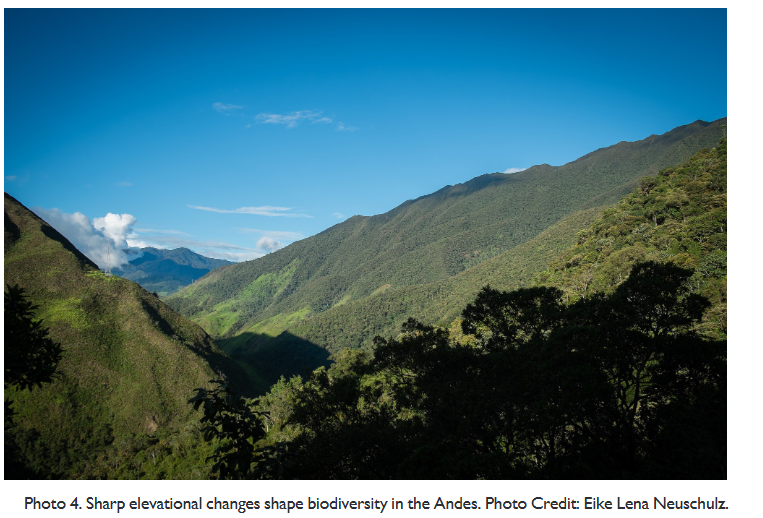

## Chapter 1: Inferring network assembly

-   Species level frugivore bird - plant interaction networks in
    replicated sites across the gradient

-   Field observations, expert species id.

-   Which assembly process can we infer from the variation in network
    metrics along the climatic gradient?

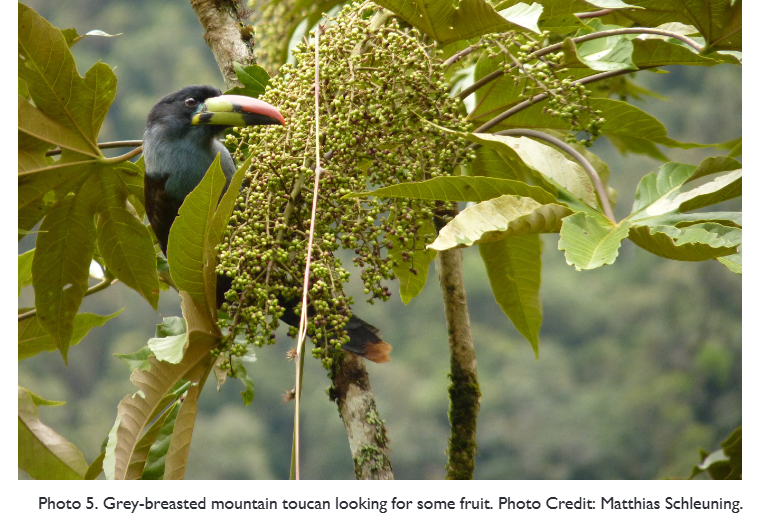

## Chapter 1: Inferring network assembly \| Process-based species pool delineation

::::: columns
::: {.column width="40%"}
-   Climate resistance layer from WorldClim (Slope + Temp + Prec + Elev)

-   Least cost path distances
:::

::: {.column width="60%"}
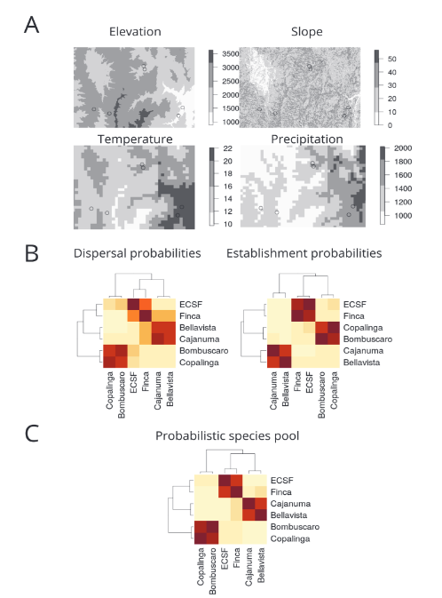{fig-align="center" width="400"}
:::
:::::

## Chapter 1: Inferring network assembly \| Quantify trait matching

::::: columns
::: {.column width="40%"}
-   Correspondence analyses on interactions

    -   PCA on plant/animal trait matrices

    -   RLQ ordination to link plant traits - interactions - animal
        traits

    -   significance with fourthcorner analyses.

-   RLQ axes as trait axis for environmental filtering and interaction
    assembly analyses
:::

::: {.column width="60%"}
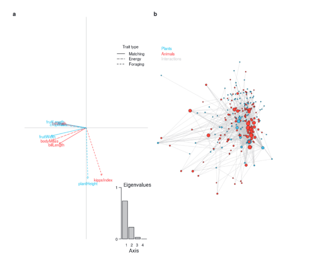{fig-align="center" width="1000"}
:::
:::::

## Chapter 1: Inferring network assembly \| Relative influence of assembly processes

::::: columns
::: {.column width="40%"}
-   Generate null networks per site randomizing:

    -   Interactions only (plants + animals fixed)

    -   Consumers + interactions

    -   Resources + interactions

    -   Consumers + resources + interactions

-   Partition effects

    -   Interaction effect

    -   Resource effect

    -   Consumer effect
:::

::: {.column width="60%"}
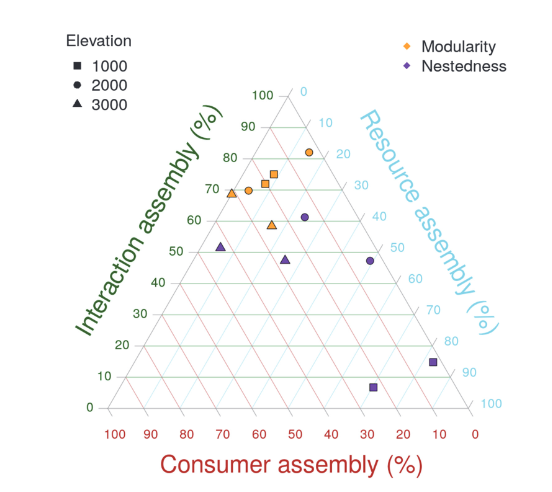
:::
:::::

# Chapter 2: Distinct functional responses of consumers and their producers to climate drive mutualistic network assembly

## Chapter 2: Conceptual framework

-   Latent trait exist along the gradient

-   How does asymmetry in FR vary across large-scale climatic gradients?

-   Does functional asymmetry constrain network structure?

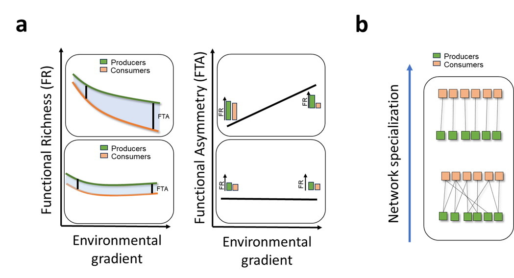

## Chapter 2: Downscaling aggregated meta-networks

::::: columns
::: {.column width="40%"}
-   Digitally available data on:
    -   Palms
    -   Mammal frugivores
-   Museum records
-   Scientific literature
-   Range maps
:::

::: {.column width="60%"}
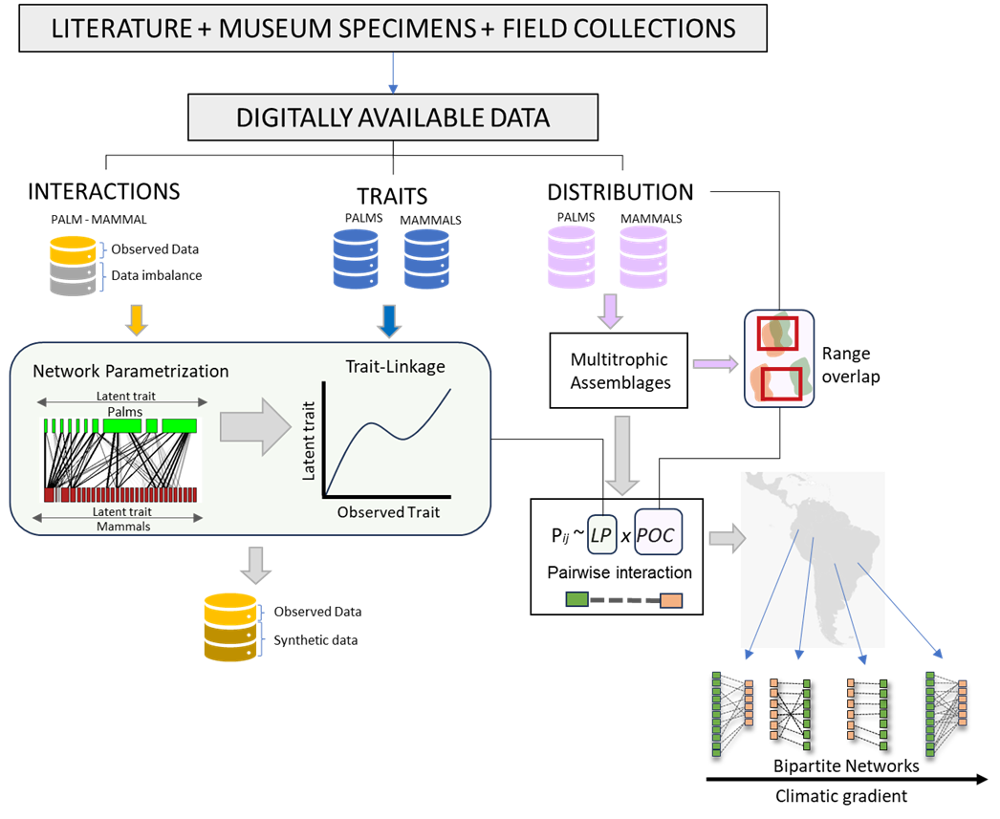{width="100%"}
:::
:::::

## Chapter 2: Network parametrization

-   Which model best infer interaction probability from binary
    interaction data?

    -   SBM: Stochastic block model

    -   MCM: Matching centrality model

    -   CM: Connectance model

    -   TMM: Trait matching model

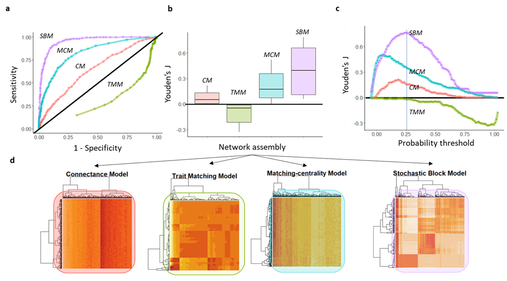

## Chapter 2: Trait-linkage

-   Delineating \<\<interaction guilds\>\> with trait data
-   Useful to predict interactions that are not observed

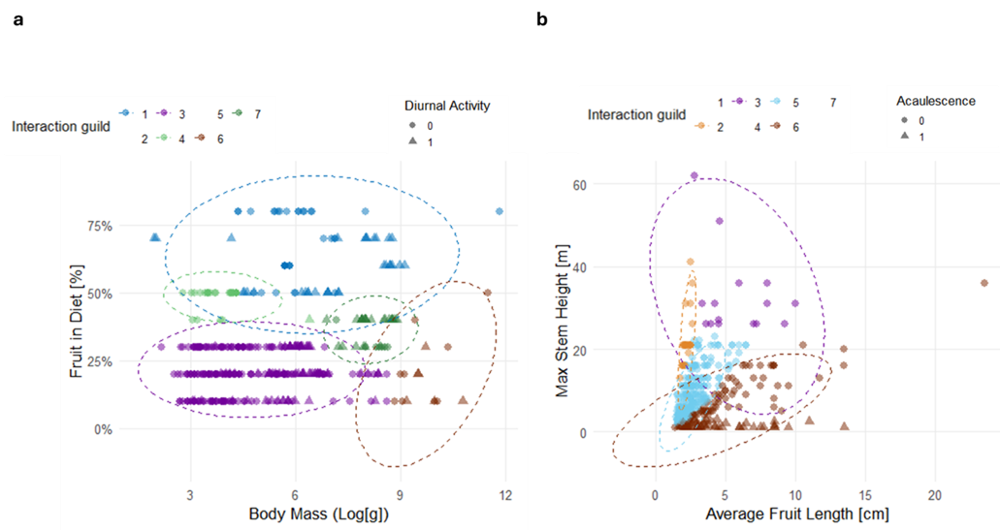

## Chapter 2: Effects of climate change in functional richness vary between palms and mammals, and generate functional trophic asymmetry

::::: columns
::: {.column width="40%"}
-   Filtering strength varies across interaction guilds\
-   Asymmetry dynamics vary across interaction guilds
-   Interaction guild-specific responses of asymmetry to climate
    gradient
:::

::: {.column width="60%"}
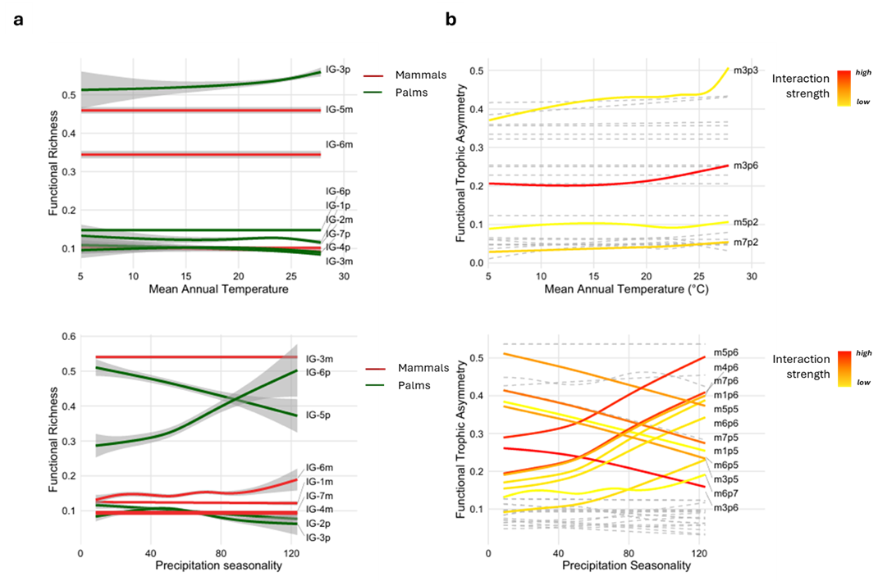{width="100%"}
:::
:::::

## Chapter 2: Effects of climate in FTA correlate with changes in network structure

::::: columns
::: {.column width="50%"}
-   Positive relationship with H2' - specialization
-   Low specialization overall

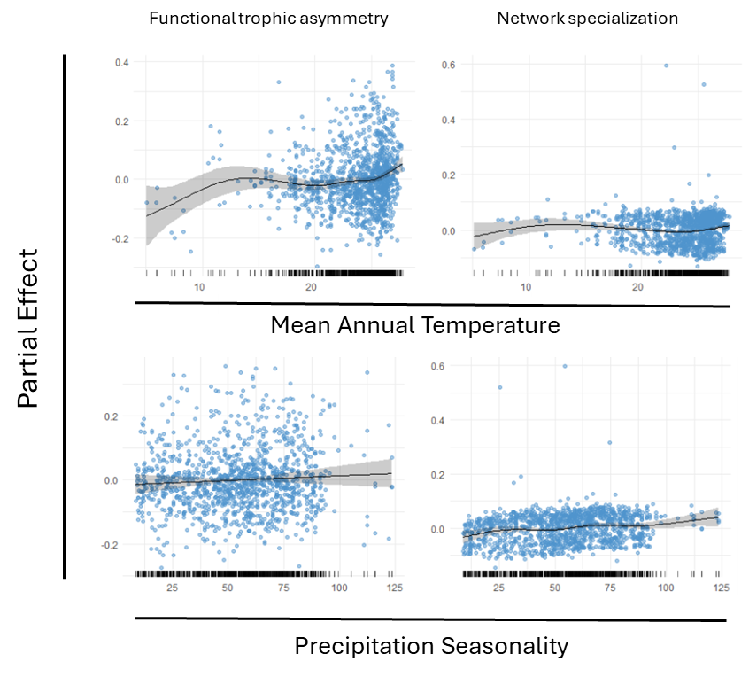
:::

::: {.column width="50%"}
-   Stronger positive relationship of FTA with Spectral radius \~
    Nestedness

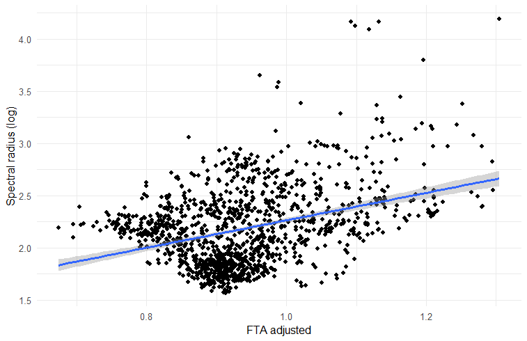
:::
:::::

# Chapter 3: Climate change and the deep-time assembly of biodiversity

I twas a long term cooling, but in average it was hoter than today

Europe was warmer and drier, arid grasslands

## Why biodiversity and climate change in deep time

::::: columns
::: {.column width="45%"}
-   Assembly inference is often limited to contemporary climate
    gradients
    -   Climate history structures species pools
-   Historical climate context is underrepresented in contemporary
    assembly processes
    -   Variation in rates of change\
    -   Variation in climatic instability
:::

::: {.column width="55%"}
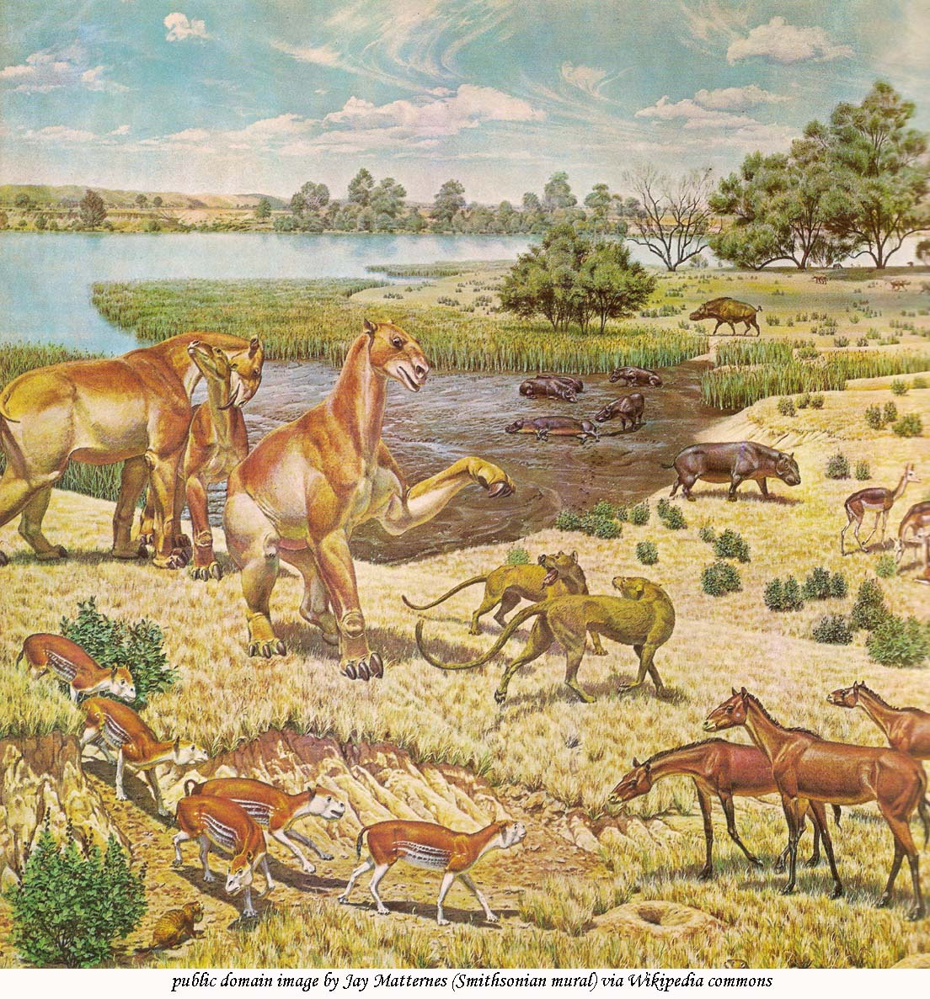{width="100%"}
:::
:::::

## Chapter 3: Conceptual framework

-   How do rates and instability of climate change influence taxonomic
    turnover across deep time?
-   Are responses to climate change consistent across continents and
    trophic guilds?

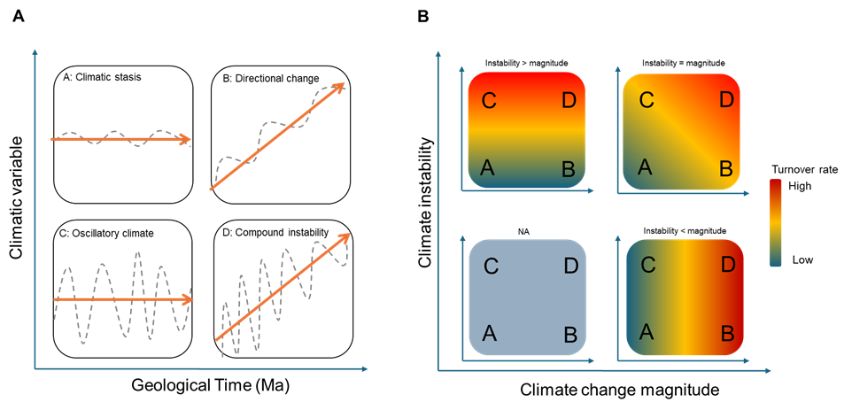

## Chapter 3: Deep-time climate dynamics across the Neogene

::::: columns
::: {.column width="45%"}
-   Digitally available paleoatmospheric temperature reconstructions\
    (Hagen et al., 2019)
    -   Fossil plant ranges
    -   Köppen zones
    -   Orogenesis models
-   GAM-based feature engineering to derive historical change metrics
-   Raster layer time series
    -   23Ma - 2Ma
    -   1Ma resolution
:::

::: {.column width="55%"}
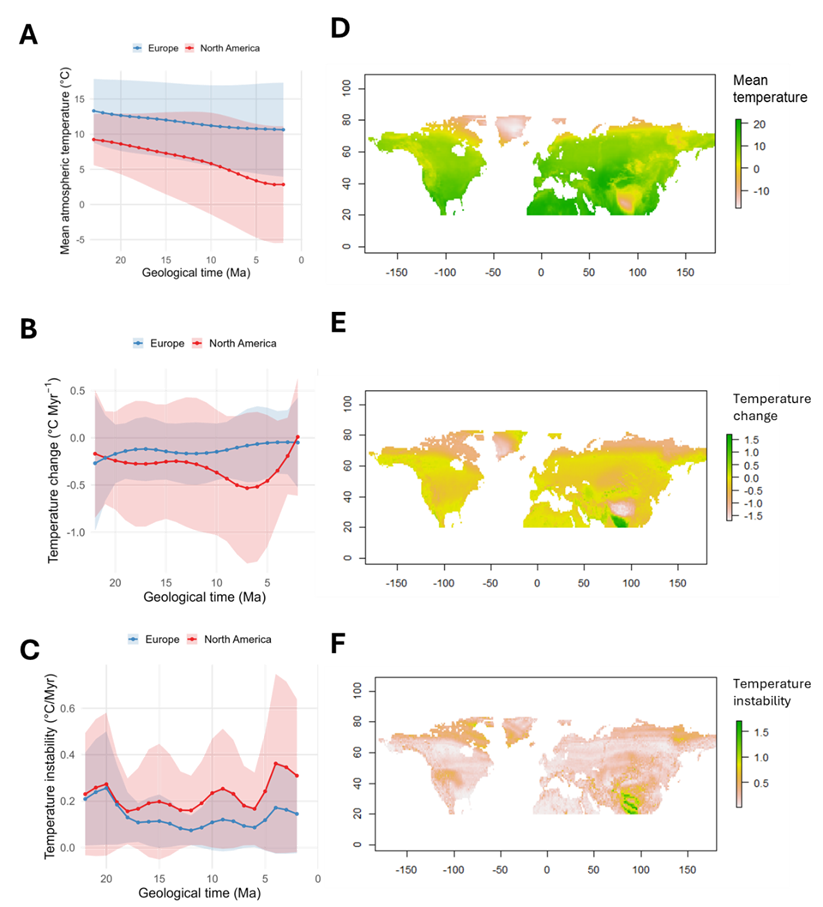{width="80%"}
:::
:::::

## Chapter 3: Fossil genus turnover across deep time

-   Large mammal fossil spatiotemporal data from NOW database

    -   North America

    -   Europe

-   100 KM fossil assemblages - 1 Ma

-   $\beta_{sim}$ : Simpson component of species dissimilarity
    (Turnover)

## Chapter 3: Modelling the effects of climate in fossil turnover

::::: columns
::: {.column width="50%"}
-   Generalized dissimilarity modelling (GDM)

-   Richness of fossil assemblages used as model weights

-   Explained deviance against a null model (permuting predictors but
    retaining spatial structure)
:::

::: {.column width="50%"}
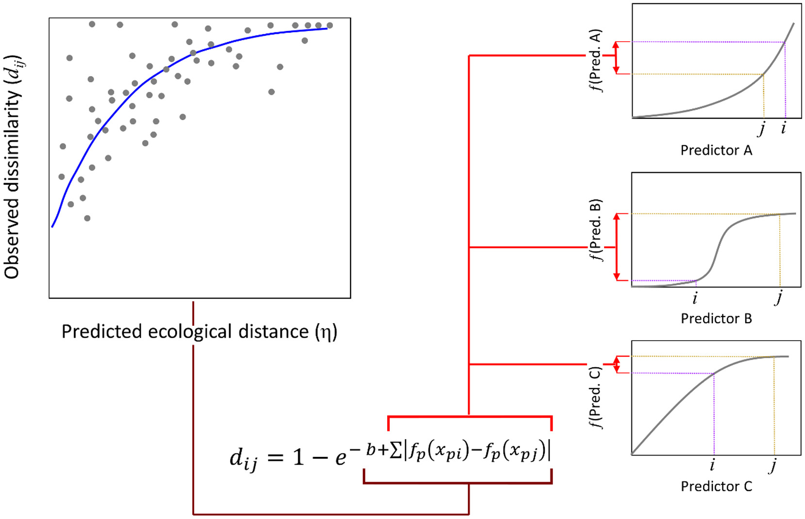{width="100%"}
:::
:::::

$\log(\beta_{sim}) =
    \beta_0 +
    \beta_1 \Delta \text{TempChange} +
    \beta_2 \Delta \text{TempInst} +
    \beta_3 \Delta \text{MeanTemp} +
    \beta_4 \Delta \text{Space} +
    \beta_5 \Delta \text{Time} +
    \epsilon$

## Chapter 3: Spatial and temporal drivers of mammal assembly across the Neogene

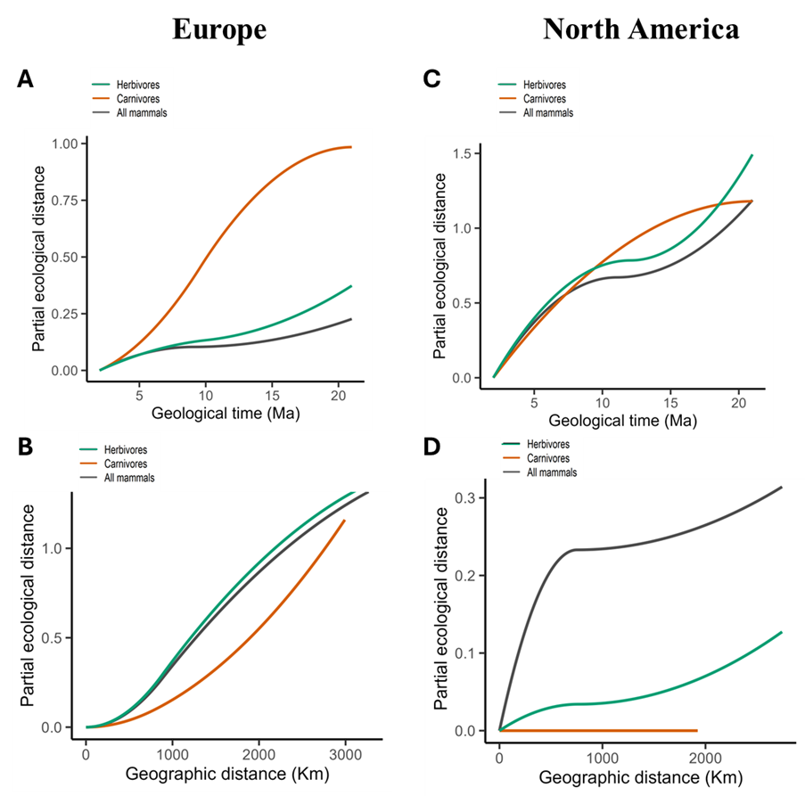

## Chapter 3: Climate drivers of mammal assembly across the Neogene

-   Magnitude & direction of climate change the strongest predictor of
    fossil change

-   Global cooling slows down in North America coincides with increased
    fossil herbivore turnover

-   Increased turnover of carnivores in more tropical areas of North
    America and with climate warming in Europe

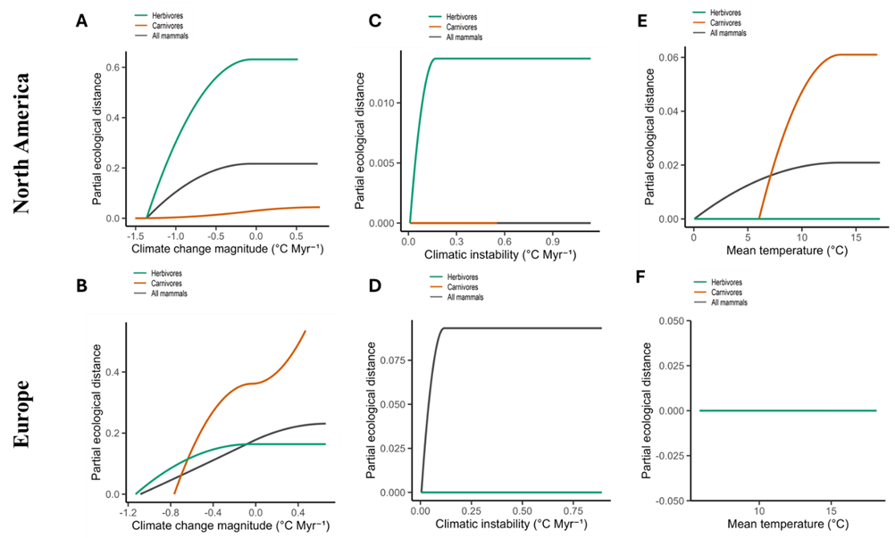

# Synthesis and Implications

## Synthesis:

-   Chapter 1: Networks are structured via trait-based environmental
    filtering with cascading bottom-up and top-down effects on the
    assembly of species interactions.

-   Chapter 2: Large-scale climate gradients filter consumers and
    resources with distinct strengths, generating functional asymmetry
    and modifying network structure

-   Chapter 3: Stronger turnover rates found in warming events within a
    long-term cooling trend, but turnover rates differs between trophic
    guild.

## Implications

-   Network architecture is not locally driven, rather is climate and
    historically conditioned

-   Community assembly respond to directional climatic transitions

    -   Hierarchical processes operating in tandem

-   Shift in assembly concept

    -   Static climatic envelopes —\> Transient dynamics

    -   Niche-neutral dicotomy –\> Relative influence of assembly
        processes

-   Climate change effects are not uniform across trophic levels

    -   Effects can cascade to other trophic levels, based on
        interaction assembly rules

    -   Computational tools to measure this effects

-   Deep time evidence of: Rapid directional shifts destabilize assembly
    more than background drift

    -   Current anthropogenic warming may trigger disproportionately
        strong reorganization.

## What's next?

**Develop a predictive framework for how ecosystems reorganize under
global change**

-   Test assembly processes in networks in disturbed and novel
    ecosystems

    -   Rewilding and restoration sites

    -   Urban and agroecosystems

    -   Invasion fronts

-   **Develop Indicators for Planetary scale Biodiversity Monitoring**

```         
-   Use Null Models / FTA and FTA–H2′ as structural indicators of
    change

-   Generalize pipelines for monitoring programs (e.g.
    biosurveillance) 

-   Make tools available to the public (geoBON)
```

# Thank you!
