# Earth as a Living System {background-image="https://cdn.mos.cms.futurecdn.net/rjdGi9hmMPhbd6Z7f3rcdT.png" background-color="black" color="white"}

How is life organized?

## Life in Earth Is Unevenly Distributed and is Constantly Changing

:::::: columns
::: {.column width="40%"}
-   **Biodiversity:** The diversity and distribution of life across
    biological levels (*genes, organsims, populations, ...*)

-   **Biological communities:** Sets of species co-occurring in space
    and time and linked by ecological interactions

-   **Biodiversity change:** Emergent organization of communities across
    ecosystems resulting from ecological and evolutionary processes

    -   Expressed as patterns in space&time

    -   Predictable processes
:::

:::: {.column width="60%"}
::: r-stack
{.r-stretch .fragment height="500"}

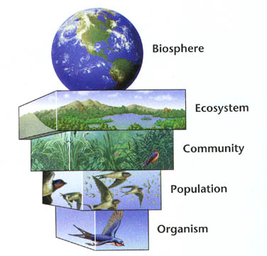{.r-stretch .fragment height="500"}

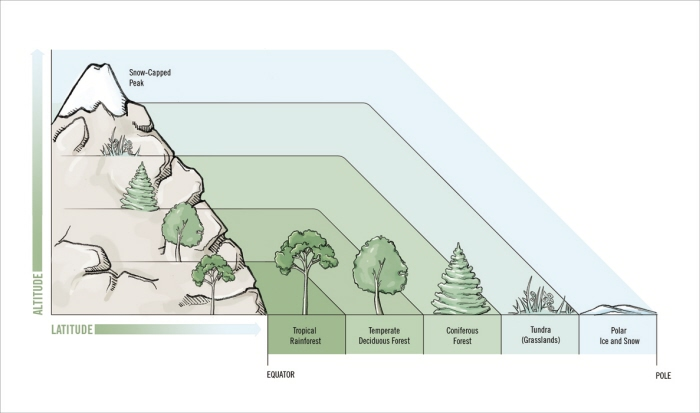{.r-stretch .fragment height="500"}

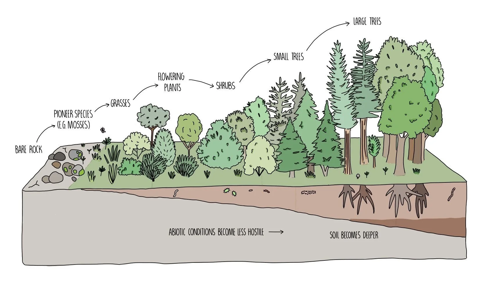{.r-stretch .fragment height="500"
width="900"}
:::
::::
::::::

## Understanding Global Biodiversity Change

:::::: columns
::: {.column width="50%"}
Multidimensional + Multiscale Expressions

-   Changes in species richness *(local \| alpha diversity)*

-   Changes in species composition *(turnover \| beta diversity)*

-   Changes in community structure *(foodweb \| network topology)*

    -   Across trophic levels

    -   Across interaction types

> Patterns != explanation
:::

:::: {.column width="50%"}
::: r-stack
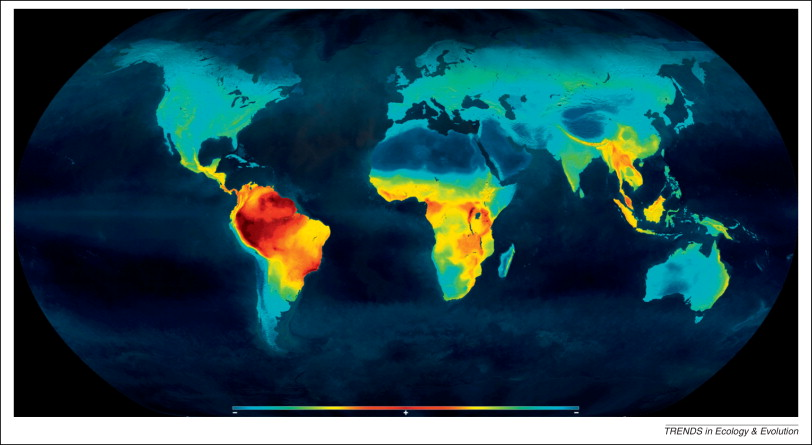{.r-stretch .fragment height="550"
width="700"}

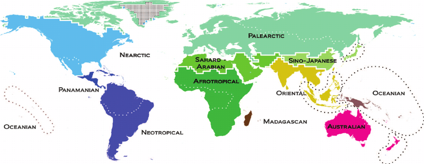{.r-stretch .fragment height="550"
width="700"}

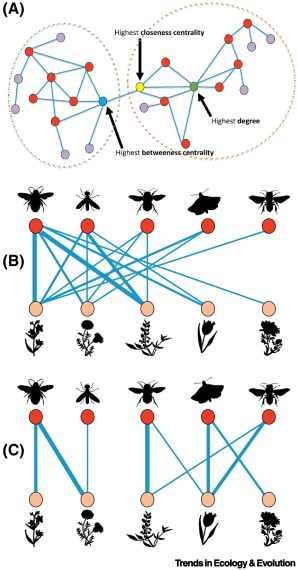{.r-stretch .fragment height="550"
width="300"}

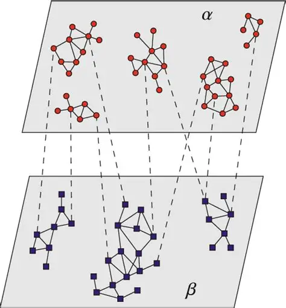{.r-stretch .fragment height="550"
width="300"}
:::
::::
::::::

## Community assembly theory as a process-based framework to understand biodiversity change

:::::: columns
::: {.column width="50%"}
*Which* species occur, *where*, *when*, and *why*?

------------------------------------------------------------------------

Mechanisms of community assembly *(Vellend 2010)*:

-   Speciation

-   *Selection*

    -   *Environmental filtering*

    -   *Biotic interactions*

-   Dispersal

-   Drift
:::

:::: {.column width="50%"}
::: r-stack
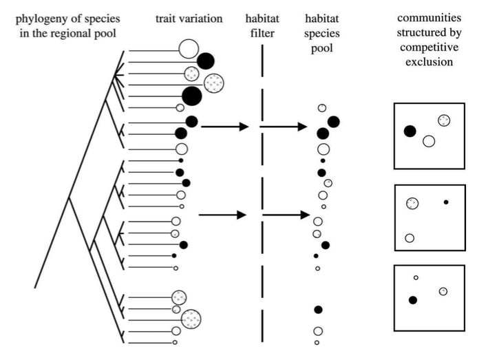{.r-stretch height="550"
width="650"}

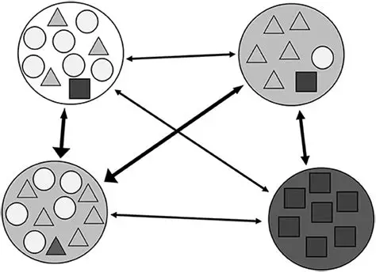{.r-stretch .fragment height="550"
width="650"}

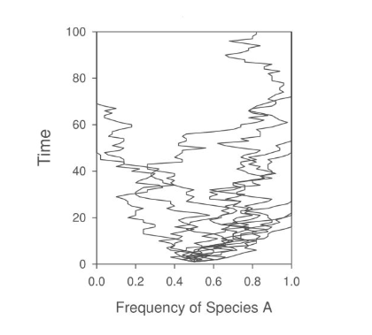{.r-stretch .fragment height="550"
width="650"}
:::
::::
::::::

## Global climate change as a driver of community assembly mechanisms

:::::: columns
::: {.column width="40%"}
Global climate changes shapes:

-   Spatial distribution of biomes

-   The evolution of species pools

-   Temporal turnover rates
:::

:::: {.column width="60%"}
::: r-stack
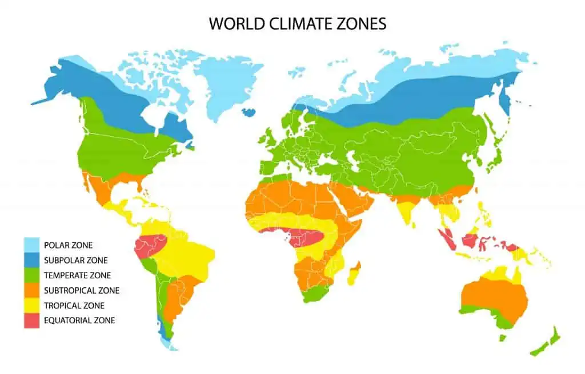{.r-stretch .fragment height="500" width="700"}

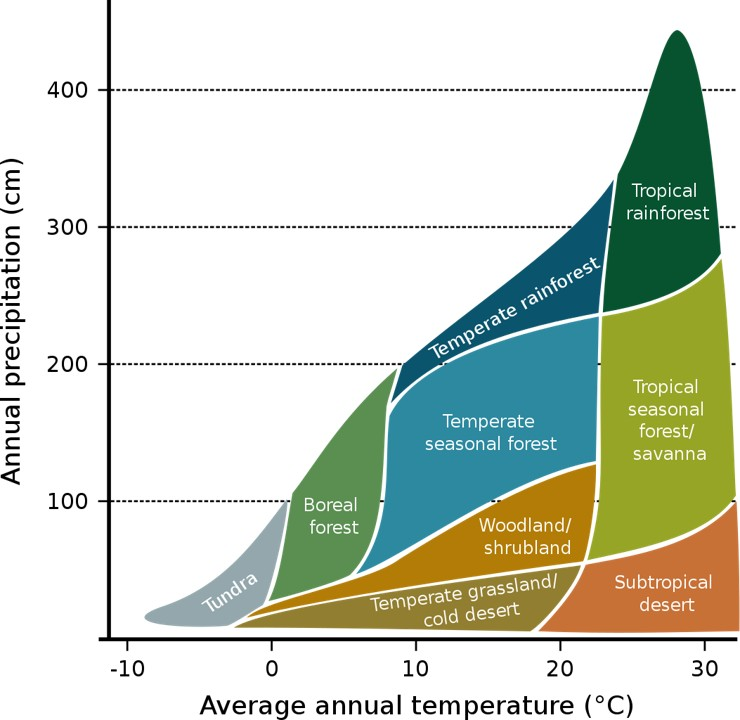{.r-stretch .fragment height="500" width="700" style="\"background:white"}

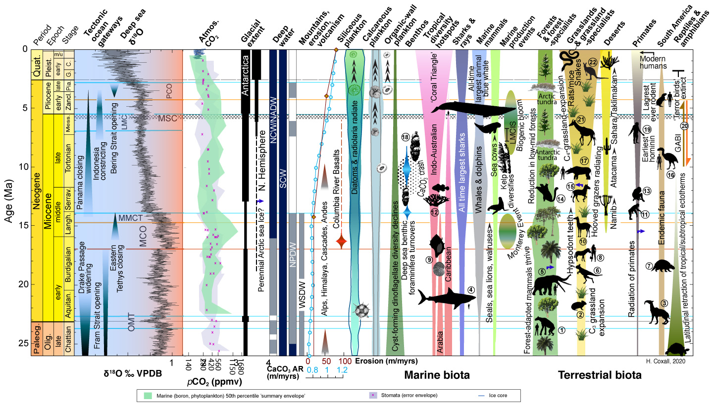{.r-stretch .fragment height="500" width="700" style="\"background:white"}


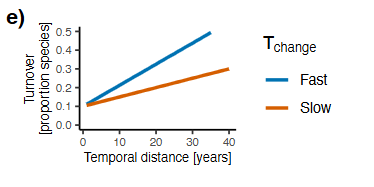{.r-stretch .fragment height="500" width="700"}


:::
::::
::::::


## Inferring Assembly Processes Under Climate Change: Key Conceptual Challenges


- **Community assembly remains an evolving analytical framework**


  - Longitudinal processes are inferred from largely snapshot data
  
  - Primarily developed under contemporary environmental conditions
  
  - Historical dynamics remain poorly resolved
    
  
- **Assembly processes are typically inferred within single trophic levels**
  
  - Implicit assumptions of species independence

  - Limited integration of interactions within selection (environmental filtering × biotic interactions: $EF \times I$)


- **The role of assembly in shaping community structure remains unresolved**

  - Is network structure an emergent property of community assembly? 
  
  - Do assembly processes operate bottom-up, top-down, or across trophic levels?


  
## Inferring Assembly Processes Under Climate Change: Key Analytical Challenges
  
    
- **Large-scale assembly models are data- and computation-intensive** 

  - Many algorithms are not readily scalable 
  
  - Methods are required to manage high dimensionality
  
  - Simulation-based approaches are computationally demanding

- **Global biodiversity data remain sparse and uneven** 

  - Uneven coverage across trophic levels
  
  - Imbalanced representation across data types (e.g., occurrences vs. interactions)
  
  - Data synthesis efforts are advancing but remain incomplete


## From challenges to opportunity in ecological assembly 


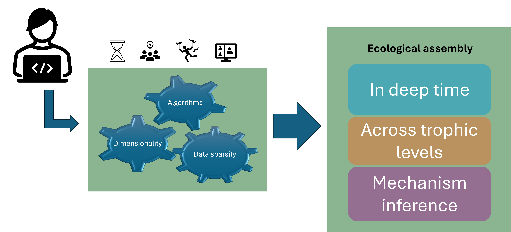{.r-stretch height="500" width="700"}


# Thesis overview

-   Chapter 1: How deeptime climatic dynamics shapes species pools?

-   Chapter 2: How large scale climatic filtering operates across trophic levels?

-   Chapter 3: How to infer assembly processes across changing landscapes?


# Chapter 1 
Climate change drove the deep-time assembly of biological diversity


# {background-image="images/time_back.gif"}


## The planet has cooled over time from a warmer past


:::::: columns
::: {.column width="40%"}
Earth temperature shifts:

-   A history of warm conditions

-   Cooling phase during the Neogene (23-2 Ma)

-   Modern mammal faunas emerged during the Neogene

:::

:::: {.column width="60%"}
::: r-stack
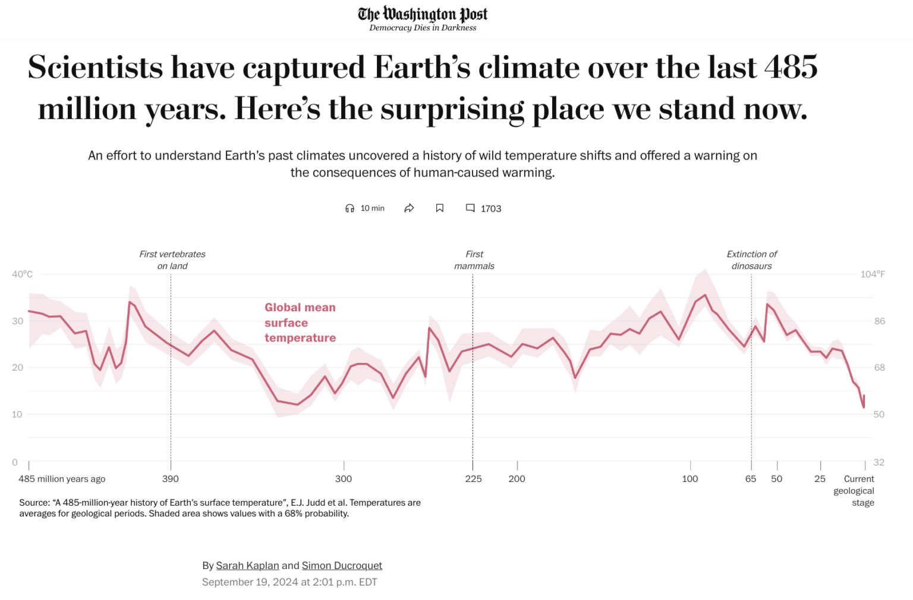{.r-stretch .fragment  height="500" width="700"}


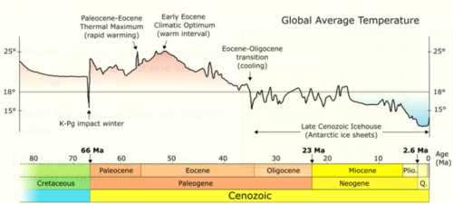{.r-stretch .fragment height="500" width="700"}
:::

::::
::::::

# The Neogene (23 - 2 Ma) {background-image="images/neogene_fauna.jpg" background-color="black" color="white"}
Earth was cooling but still hotter than today!


## Changes in surface temperature drive planetary ecosystem and biome distribution


:::::: columns
::: {.column width="40%"}


-   Surface temperature modulates the convergence latitude of  the subtropical jetstream

-   Tropical <<forest>> ecosystems typically expand during warming phases

-   Grasslands typically expand during cooling phase

:::

:::: {.column width="60%"}
::: r-stack

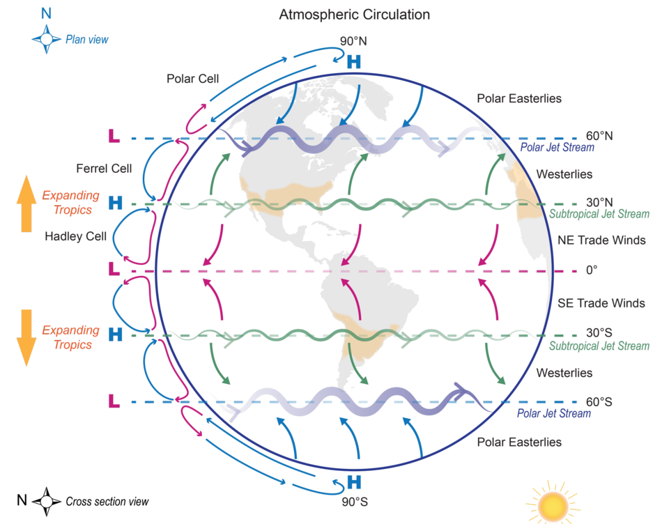{.r-stretch .fragment height="500" width="700"}
:::
::::
:::::


## How did climate change impacted the distribution of Neogene fauna? 


::::: columns
::: {.column width="45%"}


Integrative statistical modelling (23 - 2 Ma)

  - Earth surface temperature reconstructions
  
  - Large-mammal fossil records (NOW database)
  
:::

::: {.column width="55%"}


{width="80%"}


:::
:::::


## Conceptual framework


::::: columns
::: {.column width="45%"}

Earth surphace temperature change:   

  - RoT: Magnitude & direction 
  
  - Instabilty
  
> Do climate RoT and instability drive turnover?

> Are responses consistent across continents and guilds?
  
  
:::
  
::: {.column width="55%"}
:::r-stack
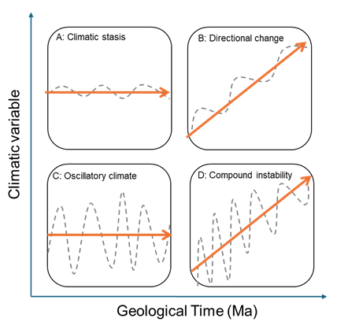{.r-stretch .fragment height="500" width="600"}


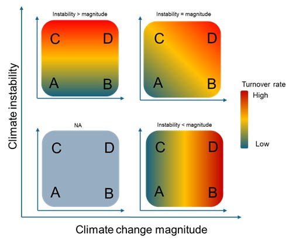{.r-stretch .fragment height="500" width="700" background-color="white"}
:::
:::
:::::

## Methods 

::::: columns
::: {.column width="50%"}

- Large mammal fossil data fpr Northamerica & Europe 

  - aggregated to 1Ma & 100 $Km^2$ assemblages 
  
  - genus level records
  
  - Estimated richness 

  - $\beta_{sim}$ : Simpson component of species dissimilarity
      (Turnover)

## Modelling the effects of climate in fossil turnover

::::: columns
::: {.column width="50%"}
-   Generalized dissimilarity modelling (GDM)

-   Richness of fossil assemblages used as model weights

-   Explained deviance against a null model (permuting predictors but
    retaining spatial structure)
:::

::: {.column width="50%"}
{width="100%"}
:::
:::::

$\log(\beta_{sim}) =     \beta_0 +     \beta_1 \Delta \text{TempChange} +     \beta_2 \Delta \text{TempInst} +     \beta_3 \Delta \text{MeanTemp} +     \beta_4 \Delta \text{Space} +     \beta_5 \Delta \text{Time} +     \epsilon$

  
  
  


# Chapter 2
Distinct functional responses of consumers and their producers to climate drive mutualistic network assembly


# Chapter 3
Trait-based inference of ecological network assembly


## Species traits reflect adaptations to climate

:::::: columns
::: {.column width="30%"}
-   Physiological adaptations

-   
:::

:::: {.column width="60%"}
::: r-stack
:::
::::
::::::

## Species traits reflect biotic interactions

:::::: columns
::: {.column width="30%"}
-   Interactions are constrained by traits

    -   Body size

    -   Morphology

    -   Diet

-   Trait matching

    -   Who interacts with whom
:::

:::: {.column width="60%"}
::: r-stack
:::
::::
::::::

## The structure of ecological networks

:::::: columns
::: {.column width="30%"}
-   Interactions modify species population growth rates

    -   Stability and long-term persistence

    -   Non-random network structurese
:::

:::: {.column width="60%"}
::: r-stack
:::
::::
::::::


## Deep-time climate dynamics across the Neogene


## Spatial and temporal drivers of mammal assembly across the Neogene


## Climate drivers of mammal assembly across the Neogene

-   Magnitude & direction of climate change the strongest predictor of
    fossil change

-   Global cooling slows down in North America coincides with increased
    fossil herbivore turnover

-   Increased turnover of carnivores in more tropical areas of North
    America and with climate warming in Europe


# Chapter 2: Distinct functional responses of consumers and their producers to climate drive mutualistic network assembly

## Biotic interactions shape community structure

> Species interactions modifies species population growth rates within
> communities

-   Within trophic levels
    -   Competitive exclusion
-   Across trophic levels
    -   Predation
    -   Mutualisms
    -   Parasitims
    -   Etc.

## Functional traits bridge environmental gradients and species interactions

## Chapter 2: Conceptual framework

-   Latent trait exist along the gradient

-   How does asymmetry in FR vary across large-scale climatic gradients?

-   Does functional asymmetry constrain network structure?


## Data integration challenge

-   Ecological data are scattered across:

    -   Literature

    -   Museum records

    -   Private databases

-   Global datasets are now available and open-source

    -   Integrating multiple types of environmental and biodiversity
        data \\

    -   Unified analytical frameworks

    -   Climate change modifies not just where species can live, but
        which combinations of traits and interactions are feasible

## Chapter 2: Downscaling aggregated meta-networks

::::: columns
::: {.column width="40%"}
-   Digitally available data on:
    -   Palms
    -   Mammal frugivores
-   Museum records
-   Scientific literature
-   Range maps
:::

::: {.column width="60%"}
{width="100%"}
:::
:::::

## Chapter 2: Network parametrization

-   Which model best infer interaction probability from binary
    interaction data?

    -   SBM: Stochastic block model

    -   MCM: Matching centrality model

    -   CM: Connectance model

    -   TMM: Trait matching model


## Chapter 2: Trait-linkage

-   Delineating \<\<interaction guilds\>\> with trait data
-   Useful to predict interactions that are not observed


## Chapter 2: Effects of climate change in functional richness vary between palms and mammals, and generate functional trophic asymmetry

::::: columns
::: {.column width="40%"}
-   Filtering strength varies across interaction guilds\
-   Asymmetry dynamics vary across interaction guilds
-   Interaction guild-specific responses of asymmetry to climate
    gradient
:::

::: {.column width="60%"}
{width="100%"}
:::
:::::

## Chapter 2: Effects of climate in FTA correlate with changes in network structure

::::: columns
::: {.column width="50%"}
-   Positive relationship with H2' - specialization
-   Low specialization overall


:::

::: {.column width="50%"}
-   Stronger positive relationship of FTA with Spectral radius \~
    Nestedness


:::
:::::

# Chapter 1: Trait-based inference of ecological network assembly

## Trophic cascades can structure communities

```         
-   Top-down     -   Mesopredator release -   Bottom-up     -   Resource availability
```


::::: columns
::: {.column width="40%"}
-   

-   Does assembly processes generate emergent network structure?

-   Simulating network assembly

-   Inferring assembly processes using trait-based null models
:::

::: {.column width="60%"}

:::
:::::

## Chapter 1: Simulating network assembly

::::: columns
::: {.column width="50%"}
-   Individual-based, spatially implicit assembly models
    -   Reference-pool species vary in abundance and trait values
    -   Immigration is trait-filtered
    -   Established lineages diversify via neutral stochastic drift
-   Community assembly
    -   `SEF`: environmental filtering
    -   `ND`: neutral dynamics
-   Interaction assembly
    -   `MM`: morphological matching
    -   `FL`: forbidden links
    -   `NL`: stochastic interactions (abundance)
-   Calculate **NODF** and **Q**
:::

::: {.column width="50%"}
{width="100%"}
:::
:::::

## Chapter 1: Simulating network assembly

{fig-align="center" width="700"}

## Chapter 1: Inferring network assembly \| Case study

-   Elevational gradient in the Andes of Ecuador

    -   100 m of elevation change \~ 100% plant community turnover

    -   Well preserved Andean slopes

    -   large native forest patches

    -   indigenous plant + animal communities


## Chapter 1: Inferring network assembly

-   Species level frugivore bird - plant interaction networks in
    replicated sites across the gradient

-   Field observations, expert species id.

-   Which assembly process can we infer from the variation in network
    metrics along the climatic gradient?


## Chapter 1: Inferring network assembly \| Process-based species pool delineation

::::: columns
::: {.column width="40%"}
-   Climate resistance layer from WorldClim (Slope + Temp + Prec + Elev)

-   Least cost path distances
:::

::: {.column width="60%"}
{fig-align="center" width="400"}
:::
:::::

## Chapter 1: Inferring network assembly \| Quantify trait matching

::::: columns
::: {.column width="40%"}
-   Correspondence analyses on interactions

    -   PCA on plant/animal trait matrices

    -   RLQ ordination to link plant traits - interactions - animal
        traits

    -   significance with fourthcorner analyses.

-   RLQ axes as trait axis for environmental filtering and interaction
    assembly analyses
:::

::: {.column width="60%"}
{fig-align="center" width="1000"}
:::
:::::

## Chapter 1: Inferring network assembly \| Relative influence of assembly processes

::::: columns
::: {.column width="40%"}
-   Generate null networks per site randomizing:

    -   Interactions only (plants + animals fixed)

    -   Consumers + interactions

    -   Resources + interactions

    -   Consumers + resources + interactions

-   Partition effects

    -   Interaction effect

    -   Resource effect

    -   Consumer effect
:::

::: {.column width="60%"}

:::
:::::

# nthesis and Implications

## Synthesis:

-   Chapter 1: Networks are structured via trait-based environmental
    filtering with cascading bottom-up and top-down effects on the
    assembly of species interactions.

-   Chapter 2: Large-scale climate gradients filter consumers and
    resources with distinct strengths, generating functional asymmetry
    and modifying network structure

-   Chapter 3: Stronger turnover rates found in warming events within a
    long-term cooling trend, but turnover rates differs between trophic
    guild.

## Implications

-   Network architecture is not locally driven, rather is climate and
    historically conditioned

-   Community assembly respond to directional climatic transitions

    -   Hierarchical processes operating in tandem

-   Shift in assembly concept

    -   Static climatic envelopes —\> Transient dynamics

    -   Niche-neutral dicotomy –\> Relative influence of assembly
        processes

-   Climate change effects are not uniform across trophic levels

    -   Effects can cascade to other trophic levels, based on
        interaction assembly rules

    -   Computational tools to measure this effects

-   Deep time evidence of: Rapid directional shifts destabilize assembly
    more than background drift

    -   Current anthropogenic warming may trigger disproportionately
        strong reorganization.

## What's next?

**Develop a predictive framework for how ecosystems reorganize under
global change**

-   Test assembly processes in networks in disturbed and novel
    ecosystems

    -   Rewilding and restoration sites

    -   Urban and agroecosystems

    -   Invasion fronts

-   **Develop Indicators for Planetary scale Biodiversity Monitoring**

```         
-   Use Null Models / FTA and FTA–H2′ as structural indicators of
    change

-   Generalize pipelines for monitoring programs (e.g.
    biosurveillance) 

-   Make tools available to the public (geoBON)
```

# Thank you!
